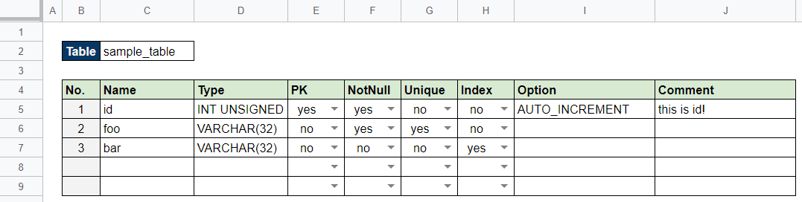

# tdconverter

This is a CLI tool to make easy to convert table definition files to SQL and Go struct etc.

<!-- vscode-markdown-toc -->
* [Description](#Description)
* [Install](#Install)
* [Requirements](#Requirements)
* [Usage](#Usage)
	* [Create the table definitions](#Createthetabledefinitions)
	* [Create SQL or Go struct](#CreateSQLorGostruct)
	* [Show Configurations](#ShowConfigurations)

<!-- vscode-markdown-toc-config
	numbering=false
	autoSave=true
	/vscode-markdown-toc-config -->
<!-- /vscode-markdown-toc -->

## <a name='Description'></a>Description

This tool converts table definitions to SQL and Go struct etc.
Currently this package supports SQL and Go format.

For example, if the table definition is like...



SQL is output as follows.

```bash
$ tdconverter -i sample -n sample sql
complete!
```

```sql
# This file generated by tdconv. DO NOT EDIT.
# See more details at https://github.com/takuoki/tdconv.
DROP TABLE IF EXISTS sample_table;
CREATE TABLE `sample_table` (
    `id` INT UNSIGNED NOT NULL AUTO_INCREMENT COMMENT 'this is id!',
    `foo` VARCHAR(32) NOT NULL UNIQUE,
    `bar` VARCHAR(32),
    PRIMARY KEY (id),
    INDEX `bar_key` (bar)
);
```

Go struct is output as follows.

```bash
$ tdconverter -i sample -n sample go
complete!
```

```go
// This file generated by tdconv. DO NOT EDIT.
// See more details at https://github.com/takuoki/tdconv.
package main

import(
  "time"
)

type sampleTable struct {
  ID *int
  Foo *string
  Bar *string
}
```

## <a name='Install'></a>Install

If you have a Go environment, you can install this tool using `go get`.
Before installing, enable the Go module feature.

```bash
go get github.com/takuoki/tdconv/tools/tdconverter
```

If not, download it from [the release page](https://github.com/takuoki/tdconv/releases).

## <a name='Requirements'></a>Requirements

This tool uses Google OAuth2.0. So before executing tool, you have to prepare `credentials.json`.
See [Go Quickstart](https://developers.google.com/sheets/api/quickstart/go), or [Blog (Japanese)](https://medium.com/veltra-engineering/how-to-use-google-sheets-api-with-golang-9e50ee9e0abc) for the details.

## <a name='Usage'></a>Usage

### <a name='Createthetabledefinitions'></a>Create the table definitions

Copy [the table definition template](https://docs.google.com/spreadsheets/d/11LTAP5-ji4w0Kqinc4GOBXEueOXndmw7JRNLtuTPo5E), and fill the value as you need.

### <a name='CreateSQLorGostruct'></a>Create SQL or Go struct

After you've finished written a table definition, you can create SQL files with the `sql` sub command of this tool.
If you want to output them as Go format, use the `go` sub command.
For usage, the `sql` and `go` commands are almost same, so this `README` only contains the `sql` examples.

Output a file with `--sheetid` or `-i` option.
In this case, all sheets are output.

```bash
$ tdconverter -i 1B8iFPPfyx81Q_0YDzGMN-a6zIw82B0x583A1eqcg_xA sql
complete!
```

If the sheet is already registered in [the configuration](#ShowConfigurations), you can use that alias.

```bash
$ tdconverter -i sample sql
complete!
```

If you use `--sheetname` or `-n` option, you can output a file for only that sheet.

```bash
$ tdconverter -i sample -n sample sql
complete!
```

If you want to output files for each sheet, use `--multi` or `-m` option.

```bash
$ tdconverter -i sample -m sql
complete!
```

If you want to use common columns feature, specify the common sheet using `--common` or `-c` option.

```bash
$ tdconverter -i sample -c common sql
complete!
```

### <a name='ShowConfigurations'></a>Show Configurations

You can show the configurations with `conf` sub command.
Following list is the default configurations.

```bash
$ tdconverter conf
  NAME               | ALIAS  | SPREADSHEET ID
------------------------------------------------------------------------------
  tdconverter-sample | sample | 1B8iFPPfyx81Q_0YDzGMN-a6zIw82B0x583A1eqcg_xA
  tdconverter-common | common | 1MWfimYqzTtHwuw4i8JCZZwDnsvLCBVQGiOyMpH8-2IQ
```

You can add some configurations to `tdconverter.json`.

```json
{
  "sheets": [
    {
      "name": "your sheet",
      "alias": "alias",
      "spreadsheet_id": "XXXXXXXXXXXXXXXXXXXXXXXXXXXXXXXXXXXXXXXXXXXX"
    }
  ]
}
```
